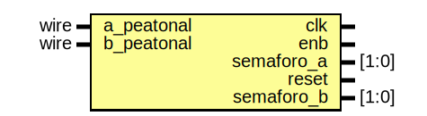

# Entity: calle 
- **File**: calle.v
- **Title:**  calle

## Diagram

## Description

## Ports

| Port name  | Direction | Type      | Description                               |
| ---------- | --------- | --------- | ----------------------------------------- |
| clk        | input     | wire      | Esta es la entrada del reloj              |
| enb        | input     | wire      | Esta es la entrada de encendido           |
| semaforo_a | input     | wire[1:0] | Esta es la entrada del semáforo A         |
| reset      | input     | wire      | Esta es la entrada del reset              |
| semaforo_b | input     | wire[1:0] | Esta es la entrada del semáforo B         |
| a_peatonal | output    |           | Esta es la salida del semáforo peatonal A |
| b_peatonal | output    |           | Esta es la salida del semáforo peatonal B |

## Constants

| Name     | Type | Value | Description                 |
| -------- | ---- | ----- | --------------------------- |
| rojo     |      | 2'b00 | Color rojo del semáforo     |
| amarillo |      | 2'b01 | Color amarillo del semáforo |
| verde    |      | 2'b10 | Color verde del semáforo    |

## Processes
- unnamed: ( @(posedge clk) )
  - **Type:** always
  - **Description**
  Este proceso se encarga de revisar primeramente, si la entrada eneble esta activa o no, y si el reset esta desactivado de modo que revise posteriormente las condiciones para que los semáforos se activen, donde en caso de que el semáforo a este en rojo y el b este en verde, se procederá a activar el semáforo peatonal a, en caso contrario, se encenderá el b, si ninguna de estas situaciones, sucede ambos semáforos se mantendrán apagados
 
# Entity: calle_tester 
- **File**: calle_tester.v
- **Title:**  Pruebas de la calle

## Diagram

## Description

Este módulo se encarga de realizar las pruebas correspondientes
para saber si los semáforos funcionan correctamente
Dependiendo del entorno donde se ejecute este programa, dicho archivo
puede guardarse en la misma carpeta que contiene este archivo, o una
carpeta build.

## Ports

| Port name  | Direction | Type  | Description                                |
| ---------- | --------- | ----- | ------------------------------------------ |
| clk        | output    |       | Esta es la salida del reloj                |
| enb        | output    |       | Esta es la salida de encendido             |
| semaforo_a | output    | [1:0] | Esta es la salida del semáforo A           |
| reset      | output    |       | Esta es la salida del reset                |
| semaforo_b | output    | [1:0] | Esta es la salida del semáforo B           |
| a_peatonal | input     | wire  | Esta es la entrada del semáforo peatonal A |
| b_peatonal | input     | wire  | Esta es la entrada del semáforo peatonal B |

## Processes
- unnamed: (  )
  - **Type:** always
  - **Description**
  Creación de la señal del reloj para el análisis del sistema
 

# Entity: calle_testbench 
- **File**: calle_testbench.v

## Signals

| Name       | Type       | Description                   |
| ---------- | ---------- | ----------------------------- |
| clk        | wire       | Entradas y salidas a utilizar |
| enb        | wire       | Entradas y salidas a utilizar |
| reset      | wire       | Entradas y salidas a utilizar |
| a_peatonal | wire       | Entradas y salidas a utilizar |
| b_peatonal | wire       | Entradas y salidas a utilizar |
| semaforo_a | wire [1:0] | Entradas y salidas a utilizar |
| semaforo_b | wire [1:0] | Entradas y salidas a utilizar |

## Instantiations

- DUT: calle
  -  Instancia de la calle
- tester: calle_tester
  -  Instancia de las pruebas realizadas
