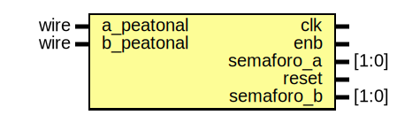

# Entity: calle_tester 
- **File**: calle_tester.v
- **Title:**  Pruebas de la calle

## Diagram

## Description

Este módulo se encarga de realizar las pruebas correspondientes
para saber si los semáforos funcionan correctamente
Dependiendo del entorno donde se ejecute este programa, dicho archivo
puede guardarse en la misma carpeta que contiene este archivo, o una
carpeta build.

## Ports

| Port name  | Direction | Type  | Description                                |
| ---------- | --------- | ----- | ------------------------------------------ |
| clk        | output    |       | Esta es la salida del reloj                |
| enb        | output    |       | Esta es la salida de encendido             |
| semaforo_a | output    | [1:0] | Esta es la salida del semáforo A           |
| reset      | output    |       | Esta es la salida del reset                |
| semaforo_b | output    | [1:0] | Esta es la salida del semáforo B           |
| a_peatonal | input     | wire  | Esta es la entrada del semáforo peatonal A |
| b_peatonal | input     | wire  | Esta es la entrada del semáforo peatonal B |

## Processes
- unnamed: (  )
  - **Type:** always
  - **Description**
  Creación de la señal del reloj para el análisis del sistema
 
