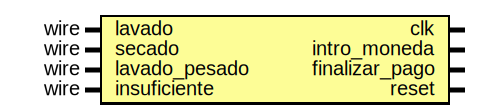

# Entity: lavadora 
- **File**: lavadora.v
- **Title:**  Lavandería

## Diagram

## Description

Este módulo se encarga de controlar la activación de las salidas
secado, lavado, lavado_pesado y insuficiente, las cuales se activarán
dependiendo de la cantidad de monedas ingresadas por el usuario al
presionar el botón finalizar_pago.

## Ports

| Port name      | Direction | Type | Description                                                  |
| -------------- | --------- | ---- | ------------------------------------------------------------ |
| clk            | input     | wire | Esta es la entrada del reloj                                 |
| intro_moneda   | input     | wire | Esta es la entrada de ingreso de monedas                     |
| finalizar_pago | input     | wire | Esta es la entrada que finaliza el pago y ingreso de monedas |
| reset          | input     | wire | Esta es la entrada del reset                                 |
| lavado         | output    |      | Esta es la salida del modo lavado                            |
| secado         | output    |      | Esta es la salida del modo secado                            |
| lavado_pesado  | output    |      | Esta es la salida del modo lavado pesado                     |
| insuficiente   | output    |      | Esta es la salida que indica un pago insuficiente            |

## Signals

| Name                  | Type      | Description                                                                                                         |
| --------------------- | --------- | ------------------------------------------------------------------------------------------------------------------- |
| mantener_insuficiente | reg       | Esta variable se utiliza para mantener la salida insuficiente encendida solo un ciclo de reloj                      |
| mantener_opcion       | reg [2:0] | Esta variable se utiliza para mantener la salidas lavado, lavado_pesado y secado encendidas hasta 7 ciclos de reloj |
| verificacion_de_pago  | reg[3:0]  | Esta variable se encarga de contar cuantas  ingresa el usuario monedas                                              |

## Constants

| Name         | Type | Value   | Description                                                      |
| ------------ | ---- | ------- | ---------------------------------------------------------------- |
| pago_lavado  |      | 4'b0100 | Cantidad de monedas para lavado                                  |
| pago_lav_p   |      | 4'b1001 | Cantidad de monedas para lavado pesado                           |
| pago_secado  |      | 4'b0011 | Cantidad de monedas para secado                                  |
| ciclos_extra |      | 3'd3    | Cantidad de ciclos extra que se debe mantener encendida la señal |

## Processes
- unnamed: ( @(posedge clk) )
  - **Type:** always
  - **Description**
  Este proceso se encarga de decidir que salidas se activan en cada flanco
  positivo del reloj.
  Se revisa si la cantidad de monedas es adecuada para alguna de las opciones de la lavanderia,
  de ser este el caso se enciende la señal correespondiente.
  Si no se ingresó una cantidad adecuada, se procede a reiniciar las señales, como se utilizan
  operadores de ejecución simultanea, la señal se apaga al detectar mantener_insuficiente es 0.
  Para apagar las señales después del tiempo necesario, se revisa si hay alguna encendida y si
  la cantidad de ciclos adicionales a mantenerla es mayor a uno, si lo anterior se cumple,
  significa que debemos restar uno a la variable mantener opción ya que esta esta activada en
  este ciclo, de lo contrario, si ya la señal se mostro la cantidad de ciclos establecida, se
  procede a apagar la misma mediante la tarea reiniciar.
 

# Entity: lavadora_tester 
- **File**: lavadora_tester.v
- **Title:**  Pruebas de lavanderia

## Diagram

## Description

En este modulo se encuentran las diferentes pruebas que confirmarán
el correcto funcionamiento del modulo descrito en el archivo
lavadora.v, de modo que se guarden en el archivo.

Dependiendo del entorno donde se ejecute este programa, dicho archivo
puede guardarse en la misma carpeta que contiene este archivo, o una
carpeta build.

## Ports

| Port name      | Direction | Type | Description                                                 |
| -------------- | --------- | ---- | ----------------------------------------------------------- |
| clk            | output    |      | Esta es la salida del reloj                                 |
| intro_moneda   | output    |      | Esta es la salida de ingreso de monedas                     |
| finalizar_pago | output    |      | Esta es la salida que finaliza el pago y ingreso de monedas |
| reset          | output    |      | Esta es la salida del reset                                 |
| lavado         | input     | wire | Esta es la entrada del modo lavado                          |
| secado         | input     | wire | Esta es la entrada del modo secado                          |
| lavado_pesado  | input     | wire | Esta es la entrada del modo lavado pesado                   |
| insuficiente   | input     | wire | Esta es la entrada que indica un pago insuficiente          |

## Processes
- unnamed: (  )
  - **Type:** always
  - **Description**
  Creación de la señal del reloj para el análisis del sistema
 

# Entity: lavadora_testbench 
- **File**: lavadora_testbench.v
- **Title:**  Testbench de la lavadora

## Diagram

## Description

Este módulo se encarga de crear una instancia tanto de la
lavadora, como de las pruebas creadas para la verificación
del correcto funcionamiento de la misma.
En caso de que no se compile correctamente, revisar que la dirección
desde donde se incluye el archivo sea la correcta, es decir,
que la carpeta desde donde se abre la terminal sea la misma donde
están los archivos.

## Signals

| Name           | Type | Description                   |
| -------------- | ---- | ----------------------------- |
| clk            | wire | Entradas y salidas a utilizar |
| intro_moneda   | wire | Entradas y salidas a utilizar |
| finalizar_pago | wire | Entradas y salidas a utilizar |
| reset          | wire | Entradas y salidas a utilizar |
| lavado         | wire | Entradas y salidas a utilizar |
| secado         | wire | Entradas y salidas a utilizar |
| lavado_pesado  | wire | Entradas y salidas a utilizar |
| insuficiente   | wire | Entradas y salidas a utilizar |

## Instantiations

- DUT: lavadora
  -  Instancia de la lavadora
- tester: lavadora_tester
  -  Instancia de las pruebas realizadas