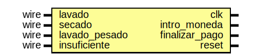

# Entity: lavadora_tester 
- **File**: lavadora_tester.v
- **Title:**  Pruebas de lavanderia

## Diagram

## Description

En este modulo se encuentran las diferentes pruebas que confirmarán
el correcto funcionamiento del modulo descrito en el archivo
lavadora.v, de modo que se guarden en el archivo.

Dependiendo del entorno donde se ejecute este programa, dicho archivo
puede guardarse en la misma carpeta que contiene este archivo, o una
carpeta build.

## Ports

| Port name      | Direction | Type | Description                                                 |
| -------------- | --------- | ---- | ----------------------------------------------------------- |
| clk            | output    |      | Esta es la salida del reloj                                 |
| intro_moneda   | output    |      | Esta es la salida de ingreso de monedas                     |
| finalizar_pago | output    |      | Esta es la salida que finaliza el pago y ingreso de monedas |
| reset          | output    |      | Esta es la salida del reset                                 |
| lavado         | input     | wire | Esta es la entrada del modo lavado                          |
| secado         | input     | wire | Esta es la entrada del modo secado                          |
| lavado_pesado  | input     | wire | Esta es la entrada del modo lavado pesado                   |
| insuficiente   | input     | wire | Esta es la entrada que indica un pago insuficiente          |

## Processes
- unnamed: (  )
  - **Type:** always
  - **Description**
  Creación de la señal del reloj para el análisis del sistema
 
